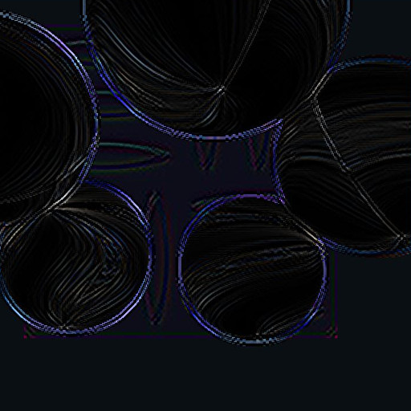

.. highlight:: python
   :linenothreshold: 25

Off-screen textures (and other more complicated things)
=======================================================

The normal result of drawing objects with pi3d is for them to appear on
the display. However there can be situations where it might be useful to
capture the output and do other processing on it before posting it to the
screen. Reasons include: blurring, distorting, edge detection and any
number of artistic post-processing effect but also collision detection,
shadow casting and stereo imaging.

In pi3d there is a class OffScreenTexture that inherits from Texture. It
isn't really intended to be used directly but other classes inherit from
it: Clashtest, Defocus, PostProcess, ShadowCaster and StereoCam. Each of
these has a similar outline work flow each frame.

  1. Start the off-screen capture
  2. Draw the objects in the scene, possibly with a special shader as with
     Clashtest or ShadowCaster but otherwise just normally i.e. PostProcess or
     StereoCam
  3. Stop the off-screen capture
  4. Process the image. Sometimes using a special shader, sometimes drawing
     the off-screen texture to a Sprite with a normal uv_flat shader. 

Because offscreen textures can be used for a wide range of reasons the
details of each one will vary greatly. However the Post-processing application
is probably the most general this is a good one to look at.

Open pi3d_demos/Post.py and, after running it to see what it does, try
commenting out the lines 67, 73 and 78. This will basically cut out the
capturing to off-screen texture and subsequent post processing so you can
see what is being captured. For the moment ignore the fancy swirling
texture on the Spheres, this is a separate complication that I will explain
later. If you look inside the pi3d/util/PostProcess.py file you will see
that although it can be called with all its arguments defaulting to values,
in this instance we are passing a Camera instance and setting the divide
argument. The reason for this is explained in the docstrings: there is
a facility to only capture part of the screen to generate a lower resolution
off screen texture which speeds up the whole rendering process quite a bit.
In order to effect this low resolution capture the camera has to be defined
with a wider field of view which is done on line 28 of pi3d_demos/Post.py
(``scale`` is a tidier alternative to defining a whole lens spec with
larger fov) And the camera is passed to the PostProcess constructor in
line 35 along with the same scaling factor, however you will notice that
the camera instance is set to self.viewcam in line 51 which is then not used!
The same camera is specified for myshape and mysprite on lines 42 and 48.
The reason for all this camera specification is the default instance behaviour
of pi3d - which will make the default camera from the first one to be
created and, as a 2D camera is created in the ``__init__()`` function of
PostProcess, care has to be taken to ensure that this doesn't become the
default instance by accident.

In PostProcess line 72 you can see the OffScreenTexture._start() method
call and some code to just render part of the screen using the glScissor
function. On line 85 OffScreenTexture._end() stops the screen capture and
draw() renders a simple subdivided quad self.sprite using self.shader, self.tex_list
and self.camera. On line 63 you will see that self.tex_list[0] points to
the PostProcess instance itself which inherits the behaviour of pi3d.Texture
via pi3d.OffScreenTexture. There are a couple of things that make this
even harder to follow: 1. on line 64 and 65 there is a facility to add
additional textures (such as bump and relfection) for use by the shader,
2. on lines 99 to 101 there is a facility to modify the ``unif`` array
of self.sprite. The pi3d_demos/Post.py example doesn't use any additional
textures (although some of the shaders in pi3d_demos/FilterDemo.py do) but
on line 78 of pi3d_demos/Post.py you will see that post.draw() is passed
a value for unif[48] that very slowly increases from 2.0 to 6.999, after
which it resets to 2.0.

Now if you look in pi3d/shader/post_base.fs - the fragment shader - you
will see on line 27 that use seems to be made of unif[16][0] (remember that
the flat c_types.float(60) array in python becomes vec3[20] in GLSL so
unif[48] in python is unif[16][0] in the shader.) But what exactly is it
doing? Well the vertex shader is very simple, essentially just setting the
vertex location in gl_Position and flipping the image top to bottom as it
sets the uniform variable texcoordout. In the fragment shader lines 26 to 29
loop nine times to increment the eventual pixel RGBA value texc. Each loop
looks up the value from the PostProcess texture using Texture2D with a
slightly offset coordinate dx[] and dy[] and a weighting factor f[]. unif[16][0]
is used as a multiplier for the dx[] and dy[] values in order to sample
the "convolution" [#]_ over a wider area. If you watch the demo for long
enough you will see the edges gradually get wider then suddenly jump back
when the value in unif[48] wraps back to 2.0.

Other Shaders
-------------

The "star" shader used to texture the Spheres in pi3d_demos/Post.py above
is another example of how you can use the GPU to do all kinds of fancy
things. Look at the source code, which was contributed by Peter Hess based
on www.iquilezles.org shadertoy demos. The shader works by converting the
texture coordinates to a polar basis in lines 25 and 26, then applying
factors that depend on an incrementing value "time" and trigonometric
transformations then using the values to lookup and modify the RGBA values
from the texture sampler.

It's quite fun to experiment with different formulas and values in shaders
but, if you do, you will probably have to put your shaders in subdirectory
of your working directory (as with pi3d_demos/shaders) and you will probably
have to "expand" the ``#include ...`` syntax used in the main pi3d shaders
as the process of figuring out the path to import from might defeat the
Shader loader!

.. [#] https://en.wikipedia.org/wiki/Kernel_(image_processing)
