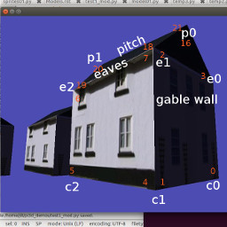
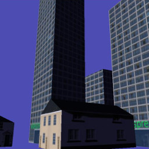
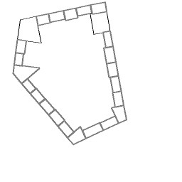

.. highlight:: python
   :linenothreshold: 25

Constructing a Shape from scratch
=================================

Hopefully you've got enough idea about the way that vertices, normals,
texture coordinates and faces fit together now to have a go at creating
something from scratch. This isn't the way that pi3d is normally used -
there are plenty of "standard" shapes, as well as the ability to import
3D models, but this exercise should be a valuable aid to understanding
what the capabilities are and how to get round any limitations you might
find.

The scope is intentionally ambitious: A procedurally generated city with
two different building types with variable, realistic surface textures.
Obviously I've spent a bit of time thinking about it but this approach
certainly isn't the only way, or even the best, but this is the logic I
follow in this example:

1. A function to construct a simple house given the position of its four
corners. The house will be similar to the Cuboid but it will have a pitched
roof (replacing two triangles with six and two extra vertices) and it doesn't
need a bottom.

2. A function to construct a simple office block given the four corners.
This will be essentially the same structure as for house but the roof will
be nearly flat and the texture mapping will be modified so that a tall
building will have more floors. This could be done using umult or vmult to
make the image repeat up the side of the building, however by using different
parts of an image it will be possible to distinguish the ground floor from
upper levels.

3. A function to generate roadside paving given the corners
of a block

4. An algorithm that can be given N corners of a polygonal block and partition
it into appropriately sized buildings. This algorithm should be able
to generate a range of building sizes and types in a controllable way.

5. An algorithm to generate a pattern of
city blocks.

Before getting stuck into **construct01.py** [#]_ It's worth explaining
a couple of things. First the class definition City is very similar to most
of the "standard" pi3d shapes defined in the pi3d/shape directory. It
inherits from Shape and calls Shape.__init__(). It also creates
arrays of vertices, normals, texture coordinates and faces and uses them
to create a new Buffer object that is appended to the Shape.buf list.
However the creation of the Buffer is done via a different method **City.make_houses()**
which is provided with a lists of "specs" each containing four tuples for
the coordinates of the corners and a height.

An additional difference from previous examples has been introduced here.
Rather than rotating the Shape, the a,d,r,f keys rotate and tilt the
Camera object. In addition the w and s keys move the Camera forwards and
backwards. The x and z movements can be calculated using simple trigonometry,
and this is the approached used in many of the demos in pi3d_demos,
however they correspond with the values already worked out for the Camera
transformation matrix so it is more processor-friendly to simply re-use
the figures as is done here. Work your way though the example and try to
convince yourself that you understand how the vertices, normals, texture
coordinates and faces are constructed. Remember that the order of vertices
in a triangle determines which is the front, there is also a similar (and
not unrelated) quirk when calculating normal directions using the cross
product of two edges, namely cross(A,B) points the opposite direction to
cross(B,A).

In **construc02.py** [#]_ most of the functionality of make_houses has
been transferred to a private method _make_buildings (denoted by the `_`
prefix, as mentioned in the introduction, this is purely a convention to
make the code easier to read, python ignores it!). This method takes two
additional arguments: 1. the height of the eaves compared with the top of the
pitch - i.e. how flat the roof will be 2. the whole of the tex_coords array
which is quite different for offices, being a long image used for all four
sides, rather than the image divided into six used for houses. There is
also an additional factor added to the spec for each house or office that
determines how much of texture to use in the uv map. If you play around
with the `spec` values in the example program you may be able to get a feel
for how this manipulation of uv values is being used.

The next illustration **construct03.py** [#]_ adds the nearly-flat raised
areas to represent the sidewalks of each block. The code to generate these
shapes is almost a re-run of houses and offices apart from the need to
have different polygons to allow triangular and pentagonal blocks, also
because the side surfaces are so small, a simplification has been allowed
to do without a set of vertices around the edge of curb. This means that
the normal direction can't be differentiated at this edge but it's not really
big enough to see anyway.

The code to "populate" a block with offices and houses is one of the
trickier aspects of this procedural generation exercise. It's not purely
graphics related but if you're interested in the process this is the logic:

  For each side of the block calculated how many buildings should be added.
  Then make a list of points that will mark the street facing corners of
  the buildings. For the corner buildings work out the fourth corner by
  seeing where two lines running in from the front corners intercept. For
  the intermediate buildings calculate the required other two (inside)
  points.

There's a little bit of algebra involved, but it's essentially just stuff
you will have learned when you were 13 or 14: simultaneous equations and
the fact that the gradient of a line is minus one over the gradient of
its perpendicular. The demo **construct04.py** [#]_ differs from previous
ones in that it is essentially a big function for generating a list of
office and house specs from a polygon representing a city block. For this
reason there is a ``if __name__ == "__main__":`` section at the bottom
that will be executed if you run this file but will be ignored when the
file is imported into something else. The bottom section draws out the
generated block and saves it as a file "temp.png" - useful while developing
the code and tweaking settings. In the next demo you may notice that there
are some deficiencies caused by the allocation of corner buildings followed
by in-filling the other edge buildings: namely there is sometimes an overlap
and sometimes a gap. A better approach would be to allocate the buildings
from corner to corner and scale the whole lot to fit.

In the final demo **construct05.py** [#]_ a list of blocks is used to generate
the specs. Ideally this would be done using a clever algorithm but that
could take a whole book on its own! There is also a simple plane to provide
the road surface and "fog" has been added to the city object. You may
remember fog when you looked inside the Shape class, it's held in the unif
array and is used by the shader to fade colours of objects in the distance.
As the calculation is done in the vertex shader it doesn't work well for
large surfaces with few vertices, like the ground plane. If you try adding
a similar fog to that you will find that the effect is strongest when you
are in the middle - the maximum distance from all the vertices! One option
would be to do the distance calculation in the fragment shader, but that
would slow it down, the alternative approach would be to subdivide the
ground surface and this is one of the benefits of using the ElevationMap
class that will be covered later.

One last new feature has been added to this demo that will be explained
more fully in the next chapter - mouse camera control. As you will have
found, the keyboard control of the camera is very "clunky" compared with
mouse movement. With mouse steering you can fly forwards and backwards
using w and s keys. You will also see one of the problems that the
ElevationMap helps to prevent - going through the ground surface!

There are various ways that the city could be improved: procedural street
layout, more varieties of building, better image textures, more structure
to the models, normal maps to give more close-up detail, reflections from
windows.. The scope is almost limitless but hopefully you now have some
idea how to approach and implement some of the more sophisticated aspects
of 3D modelling.

.. [#] https://github.com/paddywwoof/pi3d_book/blob/master/construct01.py
.. [#] https://github.com/paddywwoof/pi3d_book/blob/master/construct02.py
.. [#] https://github.com/paddywwoof/pi3d_book/blob/master/construct03.py
.. [#] https://github.com/paddywwoof/pi3d_book/blob/master/construct04.py
.. [#] https://github.com/paddywwoof/pi3d_book/blob/master/construct05.py

