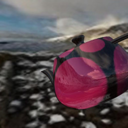
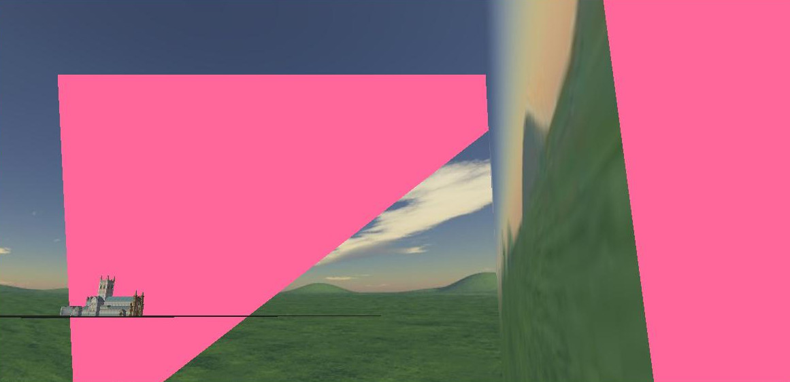
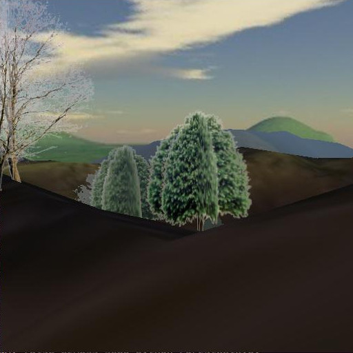

.. highlight:: python
   :linenothreshold: 25

User input and Environment Utilities
====================================

Keyboard
--------

Keyboard input has been used in all the demo programs without any real explanation
so you've probably got a good idea how to use it but it might be worth
explaining a little more about how it works.

One aspect of python that people often find strange is the absence of
non-blocking key input as a "built-in" function. The reasons is almost
certainly because of the desire to make python applications run unaltered
on all platforms. In pi3d we have to provide a host of different options for
keyboard input: CursesKeyboard, SysKeyboard, x11Keyboard, AndroidKeyboard
(which is really just a placeholder) and WindowsKeyboard. Normally the
appropriate one will be loaded for the environment you are using but this
is a surprisingly non-straightforward area that may need some careful
thought especially on non-standard platforms or using non-standard keyboards
or even simply trying to use keys that map to variable key-codes.

Mouse
-----

The Mouse class operates in a similar fashion to the Keyboard to some extent,
but the default linux (and Raspberry Pi) mechanism reads events directly
from the operating system. The disadvantage of this is that the programs
have to be launched with root privileges ($ sudo ...). The advantage is
that the mouse movements continue to provide input even when the cursor
is outside the relevant window or even "stuck" against a screen edge. This
means that it's possible to click on other things on the desktop, including
the X to close the pi3d window, if needed! To achieve the same effect with
the pygame mouse input (as used with Windows), the cursor is "warped" to the
centre of the window each frame. There are slight differences in the
behaviour of Mouse functions with the two systems but most of the demos
simply use position()

Mouse.position() returns a tuple (x, y) this can be constrained by passing
Mouse.__init__() an argument restrict=True (the default), in which case
values can also be set for the width and height that the mouse movement
is restricted.

Mouse.velocity() returns a tuple (dx, dy) which is either the distance since
the last movement or since the last call of position or velocity.

Mouse.button_status() returns either Mouse.LEFT_BUTTON, RIGHT_BUTTON,
MIDDLE_BUTTON or BUTTON_UP but varies a little in behaviour from platform
to platform.

Events
------

The InputEvents class provides a very flexible method for virtally any
kind of input, not just mouse and keyboard but also joysticks and game
controllers. However it becomes tricky to set up on linux devices with
variable input devices such as laptops with touch-pads and doesn't work on
Windows at all. In pi3d_demos the Silo.py demo uses this mechanism so
checking out that demo would be a good place to start if you need to use
this flexibility.

3D Backgrounds
--------------

In pi3d the background scenery is provided by either the EnvironmentCube
or EnvironmentSphere classes. These are basically cubes or sphere where
the triangles are defined so that they face inwards (remember the order
of vertices determines which way a surface faces in OpenGL). However the
Texture used to wrap onto the inside of the shape has to conform to the
perspective required for not distorting the scene or making the seams show.

The EnvironmentSphere is simplest in this regard, using an equirectangular
projection in which top to bottom of the image is 180 degrees and left to
right of the image is 360 degrees. If you have a modern phone you can
probably get an app to take your own "photosphere" pictures, otherwise
you can download them from various places on the internet. see [#]_

The projection for the EnvironmentCube is trickier to produce without
specialist software. There is a facility in blender to do the conversion
and there are some instructions on the FAQ [#]_

Play around with the two demo programs mentioned above, trying the different
cube layouts. Look at the image files used for each version. Notice also
that the EnvironmentSphere demo uses the same image for the reflection as
the inside of the sphere and that the orientation of the reflection correctly
matches the environment - i.e. mirror image.

It is important, when using a cube or sphere to represent the distant
background, to move it around as the camera moves. You will see that most
of the demos do this but not the BuckfastAbbey one. If you run that demo
and head out towards one of the corners you will be able to see what happens
if a) the opposite corner starts to move beyond the far plane b) the
camera moves outside the box.

ElevationMap
------------

At the end of the last chapter I touched on some of the problems caused by
representing the ground as a large horizontal quadrilateral (pi3d.Sprite).
The ElevationMap class is used in quite a few of the demos to solve these
issues, open the ForestWalk.py demo and have a look at the relevant code.
There are various things worth noting:

1. The number of "facets" that the ground is divided into is defined by
the constructor arguments divx and divy. The elevation is defined by a
combination of height argument and a grayscale image, white pixels being
taken as full height and black pixels as zero height. Notice that the number
of vertices needed when dividing a grid into 32x32 is 33x33 so if you need
exact heights to be read from the image you need to make the image one more
pixel than divx and divy and you need to use a lossless compression format
such as png. In the ForestWalk.py demo the surface has been made tileable
by making the left and right, and top and bottom, pixels identical - see
the mechanism for "tiling" in lines 125-134 and 183-185.

2. There are several useful methods in ElevationMap including calcHeight()
used here, but also clashTest() that checks if a sphere would intersect
with the surface and return the normal vector at that point (see the Pong.py
demo) and pitch_roll() that returns the X and Z rotations to apply to a
shape in order for it to lie parallel with the surface at a given point
(see the TigerTank.py demo)

.. [#] sphere http://pi3d.github.io/html/FAQ.html#sphere
.. [#] cube http://pi3d.github.io/html/FAQ.html#cube
