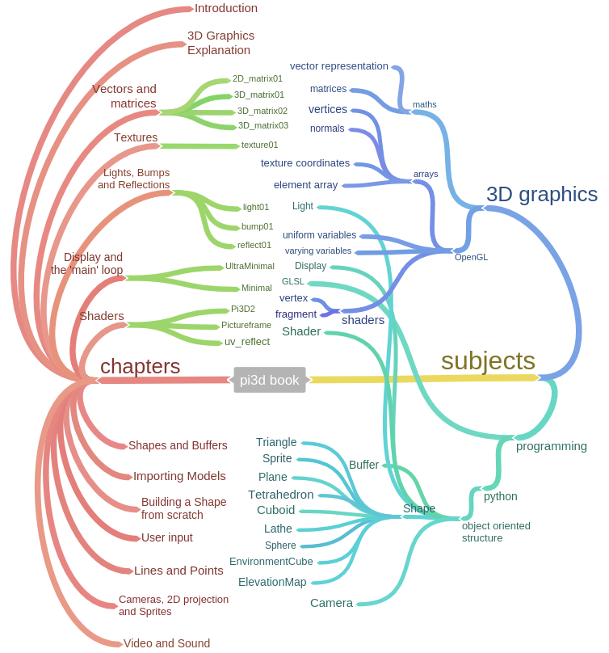

.. highlight:: python
   :linenothreshold: 25

Introduction
============

Target Audience
---------------

It's not possible to cater for all levels of knowledge and experience in
one book. Inevitably you will find sections where I cover things that you
already know and you can skip ahead quickly, but there will also be parts
that seem difficult where you will have to take it slowly and check things
out on-line (I try to include links where they might be useful but you can
always resort to google!). I assume that:

* You already know how to program (either with python to a basic level,
  or with another language to a high enough level that the switch to python
  presents few issues). Apart from things that are non-standard, such as using numpy [#]_,
  ctypes [#]_ or GLSL [#]_, I shall not explain general programming concepts or syntax. Also,
  although I will try to introduce pi3d concepts in a logical order, this
  will not necessarily correspond with the sophistication of the programming
  techniques used.

* Although not essential it will help if you have a reasonable (secondary
  school) understanding of mathematics such as basic trigonometry
  (`sin, cos, tan, arctan` [#]_, Pythagoras [#]_ etc.) and have at least come across
  `vectors and matrices` [#]_.

* You have an average understanding of computer images and display, in so
  far as they consist of pixels with red, green, blue values and that some
  file types (PNG, TIFF etc.) allow transparency per pixel with a fourth, alpha value.

* You want to learn a bit about the mechanisms of producing 3D graphics
  rather than simply find recipes for how to do things.

The Structure and how to use this book
--------------------------------------

A book on how to program, or use a module within a language, inevitably
needs lots of code to look at and run (unless it sets out to be a very
boring book). And code needs lots of comments and explanations because that's
almost the essence of good coding. So it did occur to me that the whole
book could be constructed entirely from the documentation in the example programs
that accompanied it. However, although this works for generating documentation
(as used for http://pi3d.github.io/html/index.html),
it produces too many constraints and a rather unwieldy book structure. In
the end I opted for this:

#. A narrative and overall explanation starting from the workings of the GPU
   and OpenGL, the use of vectors and matrix transformations, simple shapes and
   shaders through to complicated projects and games.

#. A set of programs that can be run to illustrate the topics covered above.
   Generally the illustrations will use pi3d to create the graphical output
   but to start with this will be glossed over as a distraction from the
   topic being explained.

#. A selection of the demo programs from github.com/pi3d/pi3d_demos. As
   familiarity and understanding grow these can become a source of ideas
   and boiler-plate code to modify.

#. The source code of pi3d. A key reason to use python is that it's easy
   to read and understand how it works. If something in pi3d doesn't do what you
   expect you are encouraged to open the source code with an editor and
   figure out what the problem is.

#. The on-line documentation. Things like installation instructions for
   different platforms, arguments and return values of class methods, and
   FAQs belong elsewhere and do not clutter up this book!

The programs are referenced from the narrative and include comprehensive
docstrings and comments. **The code and the docstrings are NOT duplicated
in the narrative** so it is essential that the book is read in conjunction
with the programs, and that the programs are *read* as well as run.

   Outline mind map from Coggle.it

Installation
------------

If you don't have pi3d set up already you need to read the relevant section here
http://pi3d.github.io/html/ReadMe.html#setup-on-the-raspberry-pi and the
paragraphs below, that apply to your platform.

At points in the book I will suggest that you look in various pi3d files
and if you installed on Raspberry Pi or Linux these will be in
``/usr/local/lib/python2.7/dist-packages/pi3d/`` (or similar), on Windows
try  ``C:\Python27\Lib\site-packages\pi3d\``. Obviously python3 would have
an appropriately different path.

You also need to get a copy of http://github.com/pi3d/pi3d_demos either
using git clone or download the zip and extract it.

And you need a copy of the example programs for this book
github.com/paddywwoof/pi3d_book

.. [#] http://www.numpy.org/
.. [#] https://docs.python.org/2/library/ctypes.html
.. [#] http://en.wikipedia.org/wiki/OpenGL_Shading_Language
.. [#] https://www.mathsisfun.com/sine-cosine-tangent.html
.. [#] https://www.mathsisfun.com/pythagoras.html
.. [#] http://www.intmath.com/vectors/vectors-intro.php
