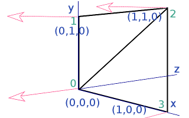
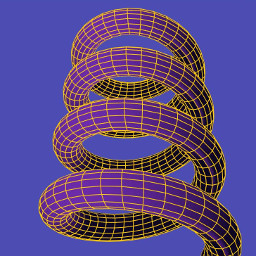
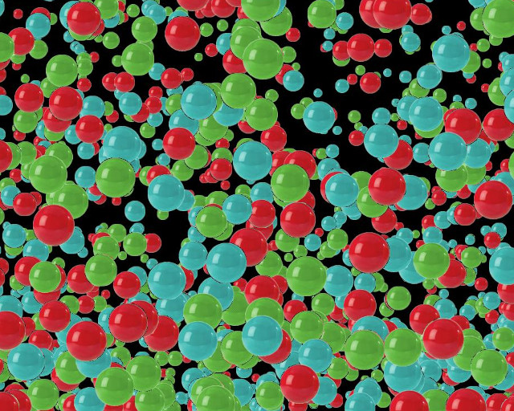

.. highlight:: python
   :linenothreshold: 25

Lines, Points and Merging
===========================================

In the chapter introducing 3D graphics I described the process of setting
up the "attribute array" of vertex information and the "element array"
essentially specifying how the vertices define the triangular faces. I then
passed quickly over the details of how the OpenGL function glDrawElements()
is called to draw the shape. In actual fact this function needs to be told
what kind of elements to draw, not just GL_TRIANGLES but also GL_POINTS,
GL_LINE_STRIP, GL_LINE_LOOP, GL_LINES, GL_TRIANGLE_STRIP, GL_TRIANGLE_FAN
work, each of which interpret the element array differently.

In pi3d.Shape there are two methods that allow switching between triangles
(the default) and points or lines.

set_line_width and set_point_size
---------------------------------

Have a look at the source code of pi3d/Shape.py around line 442 and you
will see that it is a relatively simple process of calling the OpenGL
function glLineWidth() and changing the Buffer property ``draw_method``. If
the argument ``closed`` is set to True then the line will loop from the
last point back to the first, If the width is set to zero then the draw_method
will revert to triangles. The set_point_size method above it is slightly
simpler as there is no OpenGL function to set a global point size, rather
the size is passed to the vertex shader as a uniform variable Buffer.unib[8].
This is then scaled with distance so that a point is the size specified at
one unit distance from the camera, half at two units, third at three
units etc. (Have a look at any of the standard vertex shaders to see how
this is done). Lines are always the same width however near or far away.

Now open **linepoint01.py** [#]_ and try toggling between triangles, lines
and points using the t, l and p keys. Check out the effect of using a flat
shader or lighting dependent shader and the related effect of using uv
texture mapped shader. Try the pi3d.Lines object; one thing you will find
with this is that only the mat_flat shader works as expected. This is because
the Buffer attribute array doesn't have normals or texture coordiates.
There is also a pi3d.Points class which is very similar.

   
You might also notice with many of the standard shapes drawn as lines with
the "strip" argument to set_line_width set True, that though the majority
of the lines define quadrilaterals there are some quads that have an
additional diagonal line. In fact, it might seem logical for all the
diagonals to show, after all, that's how the triangles are represented
when the 3D shapes are drawn as solid objects. However if the order of
vertices used in the element buffer is defined carefully the line drawing
can be made to (mainly) follow the edges. In the diagram, for instance,
the triangles are defined as ``[(0, 1, 2), (2, 3, 0)]`` which when used to
define a line is interpetted as 0=>1 1=>2 2=>2 2=>3 3=>0 i.e. going round the
outside. In earlier versions of pi3d the triangles may have been defined
as ``[(0, 1, 2), (0, 2, 3)]`` which would have produced a line with the
diagonal drawn twice and the edge from 3=>0 missing!

In the above example the line drawing is what would happen using GL_LINE_STRIP
which is the default behaviour of set_line_width. If the argument "strip=False"
is used then the draw method is GL_LINES and this interprets the elements
as a series of pairs defining each end of a series of lines. The result
would then be 0=>1 2=>2 3=>0 i.e. only the first and last edge would be
drawn, which you will have seen when you tried the experiments suggested
in linepoint01.py. Generally the edges will be drawn more completely using
the default "strip=True" however for standard shapes created with Shape.lathe()
(i.e. most of them!) the faces fit together to fill in the gaps. Also for
models loaded from obj files there is a tendency for extra edges to appear
joining the scattered faces and these often look better using "strip=False".

It might occasionally be nice to be able to draw a 3D object as a solid,
with directional lighting then overlay lines defining the edges of its faces.
However there are two problems with this: 1. As we have seen in the linepoint01.py
example we would need two shaders to do it nicely 2. The lines will be
exactly the same distance from the camera as the edges of the faces they
outline so there is likely to be z-fighting [#]_ or partial obscuring of
lines as the object rotates.

There are at least three ways of tackling this problem. One might be to
make a Shape with two Buffers, the first using GL_TRIANGLES with mat_light
shader, the second Buffer being a duplicate of the first but using GL_LINES and
mat_flat shader. Ideally the second Buffer would be scaled up slightly so
the lines were always drawn outside the solid version. As scaling can be
more easily done for a whole Shape it might be easier to achieve the
same result by using two Shapes, rather than Buffers with the second
Shape a child of the first one. (Look at the TigerTank.py demo to see
how child objects can be used to conveniently join Shapes together but allow
them to be moved relative to each other). In **linepoint02.py** [#]_
I use a technique of drawing the object twice each frame, once as a solid
then as a wireframe. I use the Camera transformation matrix to move the
shape slightly towards the view point between each draw. [#]_

The third example in this chapter **linepoint03.py** [#]_ introduces the
pi3d.MergeShape class. This class can be used to combine several Shape
objects into one with the advantage that only one draw() call will then
be needed. For a large number of objects, such as the trees in the
ForestWalk.py demo, this will make a very significant reduction in the
(slow) python side matrix multiplication. As well as merge() used here,
MergeShape has two other methods: radialCopy() which can be used to
produce regular patterns (see pi3d_demos/Blur.py) and cluster() which
is used to "scatter" objects randomly onto an ElevationMap,
(see pi3d_demos/ForestWalk.py).

Points using texture mapping
----------------------------

Finally, in the chapter on 'Cameras, 2D projection and Sprites' I referred
to an alternative sprite drawing method using points, for fast rendering
when the numbers get big. Open up the demo pi3d_demos/SpriteBalls.py 
There are several features of this demo that use numpy to do the bounce
and movement calculations on large arrays of vertices, I won't attempt
to explain any of that here but I do recommend trying to get to grips with
this in the longer term. For the moment it is sufficient to understand
that the sprites are represented by the vertices of a Points Shape and
that the z location is being used to represent the size of each point (see
lines 52 to 54, you can also see that the color is defined using the normal
x component on line 61). Each frame the vertices move according to "physics"
and the locations are revised using the Buffer.re_init() method (line 84)
and the points are drawn using a special shader. Now look at the shaders
pi3d_demos/shaders/uv_sprite.* (.vs and .fs)

In the vertex shader you will see that it simply sets gl_Position in the
normal way using the projection matrix (as neither the Shape nor the
Camera move, this matrix multiplication could have been eliminated by using
a different basis for the vertex coordinates). And the gl_PointSize is set
to be inversely proportional to z depth. In the fragment shader a Texture2D
lookup is performed on the texture loaded in SpriteBalls.py, however rather
than using a 2D vector calcualted from the texture coordinates (which are
not passed to the shader when using the Points class anyway), it uses
gl_PointCoord, a variable available in the fragment shader while drawing
points. To get an idea of the increased speed of this type of rendering
try increasing MAX_BALLS to several thousand as used for the image above.

.. [#] https://github.com/paddywwoof/pi3d_book/blob/master/programs/linepoint01.py
.. [#] https://en.wikipedia.org/wiki/Z-fighting
.. [#] https://github.com/paddywwoof/pi3d_book/blob/master/programs/linepoint02.py
.. [#] In this case the camera isn't moving so a simple translateZ() by a
       fixed small amount would have sufficed, however the technique used
       in the example can be used more generally.
.. [#] https://github.com/paddywwoof/pi3d_book/blob/master/programs/linepoint03.py

