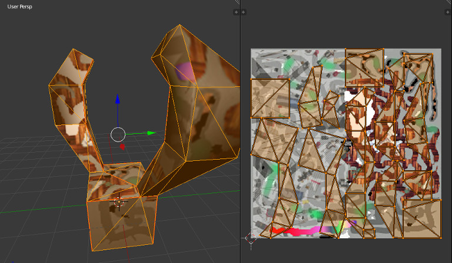

.. highlight:: python
   :linenothreshold: 25

Models
======

3D models can be made and edited using a wide variety of software and
saved in nearly as large a variety of formats. In pi3d, at the moment,
there are just two file types that can be parsed: wavefront **obj** and
Panda3D **egg**. Of these two the obj is simpler and faster to load.

   Blender screen-capture

If you have **blender** [#]_ installed on your PC then you can open the
file **model01.blend** [#]_ or you can view it by running the pi3d demo
**model01.py** [#]_ It's basically a box with horns! In the diagram above
the left view is normal perspective (as with pi3d) and the right view is
the uv "unwrapping" for texture mapping to the vertices.

Open the **blender01.obj** and **blender01.mtl** files and have a look at
the structure of the information, it should be reasonably familiar by now
with a little explanation.

Most of the obj file consists of four types of lines:

  **v vertex** lines with x, y, z coordinates.

  **vt vertex texture** lines with u, v coordinates.

  **vn vertex normal** lines with x, y, z components of normals.

  **f face** lines with a series of references to v/vt/vn lines for each
  corner of the face. In general there could be more than three corners and the
  parser function has to convert it into triangles to work with OpenGL ES2.0

Additional occasional lines are **mtllib model01.mtl** which points to material file.
**o Cube** define different objects within this file. In pi3d these will
each be a different Buffer object within one Shape. **usemtl Material**
instructs the properties from mtllib under "Material" to be used for the
following faces. **s off** and **s 1** turn smoothing off and on. Pi3d
doesn't use these instruction but does use the normals. If you look at the
lines::

  s off
  f 3/1/1 2/2/1 9/3/1 7/4/1
  f 13/5/2 14/6/2 9/7/2 2/8/2
  f 3/9/3 7/10/3 8/11/3

You will see three faces using vertices (4,2,9,7) (13,14,9,2) (3,7,8) with
normals (1,1,1,1) (2,2,2,2) (3,3,3) i.e. all corners are facing the same
direction. NB the parser will convert each of the first two quads into
triangles. Later on::

  s 1
  f 17/42/15 16/41/16 24/62/17 25/63/18
  f 15/46/19 22/49/20 30/64/21 23/65/22
  f 30/66/21 22/15/20 17/14/15 25/67/18

faces (17,16,24,25) (15,22,30,23) (30,22,17,25) have normals (15,16,17,18) (19,20,21,22)
(21,20,15,18) i.e. not a flat face. And you will see that the same vertex
used in different faces (i.e. vertex #17 or #25 above) has the same normal vector
(#15 or #18)

In the mtl file you will see that there is a **newmtl Material** to match
the usemtl line in the obj file, followed by lines specifying material
properties (Ns specular exponent, Ka ambient, Kd diffuse, Ks specular (RGB
values), d alpha, illum illumination model, map_kd a file to use for diffuse
values) Pi3d only picks up the Kd and map_kd to use as material and Texture.

.. [#] http://www.blender.org/
.. [#] https://github.com/paddywwoof/pi3d_book/blob/master/programs/model01.blend
.. [#] https://github.com/paddywwoof/pi3d_book/blob/master/programs/model01.py
