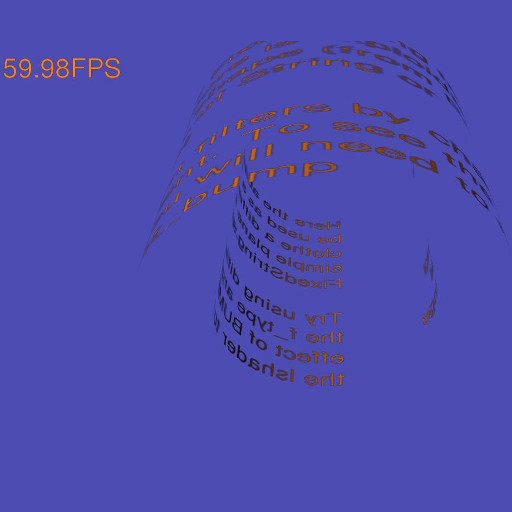

.. highlight:: python
   :linenothreshold: 25

Strings
=======

pi3d has two mechanisms for producing Text:

The first one is the pi3d.String class which inherits from pi3d.Shape in
the same way as the "standard" shapes such as Cuboid, Sphere, Sprite, Torus
etc. However as it is initialised it constructs its vertices and texture
coordinates to map rectangles from a special Texture - pi3d.Font or pi3d.Pngfont.
Each of these classes contain an image of all the letters required and a
dictionary to look up the location, width and height of each letter. pi3d.Font
is generally more useful as it is generated "on the fly" from a TrueType font
but it requires certain functionality from the Python Imaging Library, and
where that might not be available (I couldn't get it to work on Android),
pi3d.Pngfont can be used (but it's restricted to the letters on the special
png image files)

The second mechanism is the pi3d.FixedString class which inherits from
pi3d.Texture, a bit like the pi3d.Font class above but rather than containing
the full alphabet it uses a string passed to the constructor. This means that
the string can then be drawn using only four vertices and two triangles
rather than that number for every letter required by pi3d.String, so it can
be quite a bit faster on some platforms if there's lots of text. Another
of advantage of FixedString is that PIL [#]_ and numpy can be used to
provide filters: BUMP will generate a normal map, EMBOSS, CONTOUR,
BLUR and SMOOTH. The FixedString class can be used wherever a pi3d.Texture
would be used, but it also contains an instance of pi3d.Sprite (called
pi3d.FixedString.sprite) which has width, height, umult and vmult to match
the dimensions of the string to the Texture. (Look back at the chapter
``Shapes, Buffers and Display`` if you don't remember umult and vmult!)

However for varying text (such as a score, or timer) the overhead of
creating a new PIL image and converting it to a Texture every frame would
be large and in this case it is better to use the pi3d.String.quick_change()
method. This has various restrictions as described in the documentation,
the most significant of which is that the string can't be changed to a
longer length than it started (of course it should be padded by spaces initially
for this eventuality).

Have a play with the three examples **strings01.py**, **strings02.py** and
**strings03.py** [#]_ There are one or two quirks to watch out for: if you
use a 2D Camera (orthographic - argument is_3d=False) with a pi3d.String
object, then you also need to set the argument in the String constructor
to is_3d=False. Also the font passed to pi3d.String constructor is a pi3d.Font
object but the font passed to pi3d.FixedString is the path to a TrueType
font as a string.

With the rotating text you will have noticed the strange effect of the
mipmaps which are a series of lower resolution texture maps that automatically
get swapped depending on the z depth of the fragment being rendered.
The mipmaps are generated at the time of Texture creation and are generally
a good thing so the default argument to Texture is mipmap=True. 

You will find strings used in quite a few of the pi3d_demos so have a look
at those as well.

.. [#] Python Image Library - generally Pillow https://pypi.python.org/pypi/Pillow 
.. [#] https://github.com/paddywwoof/pi3d_book/blob/master/strings01.py etc
