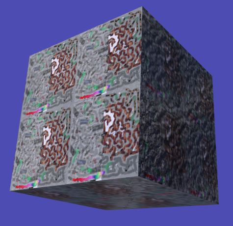
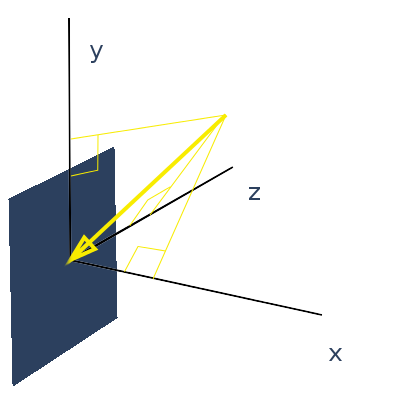
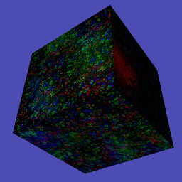

.. highlight:: python
   :linenothreshold: 25

Textures, Lights and Shaders
============================

We've touched on the roles of these three classes previously but in this
chapter I hope to give much more detail of how they fit together and how
they can be used.

Textures
--------

First of all have a look at the next illustration program **textures01.py** [#]_
and run it to see what it does. The code starts from **3D_matrices03.py** but
replaces the yellow material of the cube with an image texture, the docstrings
explain the changes.

Lights
------

Before looking at the next texture example it would be good to get more of
an idea how Light works; so open up and run the **light01.py** [#]_ example. Again,
much of the explanation that I would have put here is in the docstrings so
read them and try the experiments suggested in the text.

Now work your way through **textures02.py** [#]_ which is using all the functionality
available in the "standard" shaders. There are lots of variables to tweak
and experiments to do with this example so work your way though it slowly
and carefully.

Shaders
-------

In the next illustration we will look at what the shader is doing to
a) look up the texture values for a given pixel b) adjust for lighting.
However the code to get the normal map and reflection map is rather
complicated so I will only give an outline description of that here (if you
want to look at it in detail you will have to read through the shader yourself!)

**Caution** the language that shaders use (GLSL) is C-like in syntax, but
that in itself shouldn't be a problem, the confusing aspect is that variables
can be "different shapes". Bearing in mind that in GLSL (as in C) variable
types have to be explicitly defined:

..  code-block:: glsl

    float a = 4.12;
    vec2 b = vec2(4.12, 5.23);
    vec3 c = vec3(4.12, 5.23, 7.34);
    a = mod(a, 3.1416); // python equivalent would be a % 3.1416
    b = mod(b, 3.1416);
    c = mod(c, 3.1416);
    b = mod(b, vec2(3.1416, 6.2832);
    c = mod(c, vec3(3.1416, 6.2832, 9.4248);

You will see that generally speaking variables can be vectors which the compiled
GLSL is designed to process very fast. On the other hand branching and
conditional statements are very slow and this sometimes results in strange
program structure and use of built in functions such as ``step()`` and ``clamp()``.

One final bit of explanation before looking at the next example. The dot
product of two vectors is often described as "the length of one times the
length of the other times the cosine of the angle between them". This is
reasonably easy to apprehend in two dimensions, and when we can think of
the vectors as arrows. However in four dimension when the vectors represent
RGBA values it's not so intuitive. A better informal description would be
"how much of one vector is in the same direction as the other" it's still
easy to see how this applies to light illuminating a surface but it's much
easier to see that the dot function doesn't need to do any (slow) trigonometry,
it is sufficient to multiply the x,y,z components together and this is very
fast:

..  code-block:: glsl

    // surface facing in the same direction as x axis
    normal = vec3(1.0, 0.0, 0.0);
    // light down, from right, out of the screen
    light = vec3(-2.5, -2.5, -2.5);
    // results in -2.5 # i.e. (1.0 * -2.5) + (0.0 * -2.5) + (0.0 * 2.5)
    float a = dot(normal, light);

So now have a look at **shader01.py** [#]_ and play around with it. Any typos or
errors in the two shader scripts will be hard to track down so proceed with
caution (remember Ctrl-z can get you back to a working version!). Also,
because the GLSL is embedded in strings in the python code, the chances
are that any code formatting in your editor will not be brilliant, so here
is the code again. Vertex Shader:

..  code-block:: glsl
    :linenos:

    precision mediump float;
    attribute vec3 vertex;           // these are the array buffer objects
    attribute vec3 normal;           //  defined in Buffer
    attribute vec2 texcoord;

    uniform mat4 modelviewmatrix[2]; // [0] model movement [1] projection
    uniform vec3 unib[4];
    /* umult, vmult => unib[2][0:1] # these are defined in Buffer
       u_off, v_off => unib[3][0:1] */
    uniform vec3 unif[20];
    /* eye position => unif[6][0:3] # defined in Shape
     light position => unif[8][0:3] */

    varying vec2 texcoordout; // these values set in vertex shader which
    varying vec3 lightVector; // are picked up in the fragment shader.    
    varying float lightFactor;// However their values "vary" by
    varying vec3 normout;     // interpolating between vertices

    void main(void) {
      if (unif[7][0] == 1.0) { // a point light; unif[8] is location
        // apply the model transformation matrix
        vec4 vPosn = modelviewmatrix[0] * vec4(vertex, 1.0);
        // to get vector from vertex to the light position
        lightVector =  unif[8] - vec3(vPosn);
        lightFactor = pow(length(lightVector), -2.0); // inverse square law
        lightVector = normalize(lightVector); // to unit vector for direction
      } else {
        lightVector = normalize(unif[8]) * -1.0;    // directional light
        lightFactor = 1.0;                          // constant brightness
      }
      lightVector.z *= -1.0;                          // fix r-hand axis
      // matrix multiplication 
      normout = normalize(vec3(modelviewmatrix[0] * vec4(normal, 1.0)));
      // offset and mult for texture coords  
      texcoordout = texcoord * unib[2].xy + unib[3].xy;
      gl_Position = modelviewmatrix[1] * vec4(vertex,1.0);
      /* gl_Position is a pre-defined variable that has to be set in the
      vertex shader to define the vertex location in projection space.
      i.e. x and y are now screen coordinates and z is depth to determine
      which pixels are rendered in front or discarded. This matrix
      multiplication used the full projection matrix whereas normout
      used only the model transformation matrix*/
    }

and Fragment shader:

..  code-block:: glsl
    :linenos:

    precision mediump float;
    uniform sampler2D tex0; // this is the texture object
    uniform vec3 unib[4];
    /*     blend cutoff => unib[0][2] # defined in Buffer */
    uniform vec3 unif[20];
    /*      shape alpha => unif[5][2] # defined in Shape
              light RGB => unif[9][0:3]
      light ambient RGB => unif[10][0:3] */

    varying vec3 normout; // as sent from vertex shader
    varying vec2 texcoordout;
    varying vec3 lightVector;
    varying float lightFactor;

    void main(void) {
      gl_FragColor = texture2D(tex0, texcoordout); /* look up the basic
      RGBA value from the loaded Texture. This function also takes into
      account the distance of the pixel and will use lower resolution
      versions or mipmaps that were generated on creation
      (unless mipmaps=False was set)
      gl_FragColor is another of the pre-defined variables, representing
      the RGBA contribution to this pixel */
      // try making it a "material" color by swapping with the line above
      //gl_FragColor = vec4(0.7, 0.1, 0.4, 0.9);
      // to allow rendering behind the transparent parts of this object:
      if (gl_FragColor.a < unib[0][2]) discard;
      // adjustment of colour according to combined normal:
      float intensity = clamp(dot(lightVector, normout) *
                                        lightFactor, 0.0, 1.0);
      // try removing the 0 to 1 constraint (with point light):
      //float intensity = dot(lightVector, normout) * lightFactor;
      // directional lightcol * intensity + ambient lightcol:
      gl_FragColor.rgb *= (unif[9] * intensity + unif[10]); 
      gl_FragColor.a *= unif[5][2]; // modify alpha with the Shape alpha
    }
There is a khronos GLSL quick reference card [#]_ if you want to see what
all the functions do.

I mentioned above that I would give a general description of how the normal
map and reflection map work. If you have attempted to look at the shader
code "really" used in pi3d you will have found that it is structured with
lots of #includes so that common sections can be re-used - this makes it quite
hard to reconstruct. You may have also seen that the normal vector is not
passed from the vertex to fragment shader as shown in this example. Instead
the light vector is rotated in the vertex shader by a complicated process
(Euler angles again) so that it is correctly oriented relative to the normal
vector at that vertex *if that vector was pointing straight out of the screen*
i.e. in the -ve z direction!

The reason for this complication is that it then allows the fragment shader
to modify the normal vector by simply adding values from the RGB of a
normal map texture. Values of red less than 0.5 make the x component
of the normal negative, greater than 0.5 positive. The green values
control the y component in a similar way.

The reflection map works out the vertical and horizontal angles that a line
drawn from the camera to a given pixel would be reflected. The reflection
uses the normal vector at each pixel adjusted by the normal map as described
above. The reflection angles are then used to look up a position from a
Texture where the horizontal range is -pi to +pi (+/- 180 degrees) and the
vertical range is -pi/2 to +pi/2 (+/- 90 degrees) This is the standard
projection used for photo-spheres.

A Final look at Textures
------------------------

As a final bit of fun have a look at the **textures03.py** [#]_ demo. This
illustrates how Texture objects can be constructed from numpy arrays (or
PIL Image objects) and can be updated each loop. Although numpy or PIL are
much faster than python (they are compiled modules written in C) they are
not as fast as GPU shaders. However for some applications it can be very
convenient to manipulate reasonably small textures in this way. The
VideoWalk.py demo (on github.com/pi3d/pi3d_demos/) shows how video frames
can be read using ffmpeg and used to update a Texture. This is also a way
to use OpenCV images as Textures as they are already numpy arrays.

.. [#] https://github.com/paddywwoof/pi3d_book/blob/master/textures01.py
.. [#] https://github.com/paddywwoof/pi3d_book/blob/master/light01.py
.. [#] https://github.com/paddywwoof/pi3d_book/blob/master/textures02.py
.. [#] https://github.com/paddywwoof/pi3d_book/blob/master/shader01.py
.. [#] https://www.khronos.org/opengles/sdk/docs/reference_cards/OpenGL-ES-2_0-Reference-card.pdf
.. [#] https://github.com/paddywwoof/pi3d_book/blob/master/textures03.py

