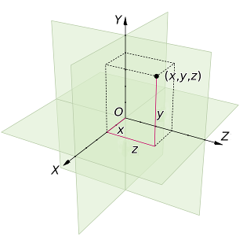
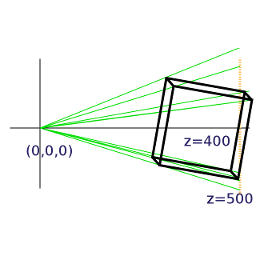

.. highlight:: python
   :linenothreshold: 25

Vectors and Matrices
====================

This subject could fill many books so the coverage here will be the minimum
to understand why the information passed to the GPU is in the form described
in the last chapter, how the vectors and matrices are generated by the
pi3d code, and what the GPU does with them. I would strongly advise you to
find out more about vectors by reading about them elsewhere; they're great!

Vectors
-------

The classic definition of a vector is something that has ``Magnitude``
and ``Direction`` - a value having only magnitude being termed ``scalar``.
Arrows are often used to represent vectors but, although this analogue is
very easy to understand, it is also a slight distraction that can make
further understanding more difficult. The crucial thing about vectors is
that they have more than one **component**. So whenever a value has to be
uniquely defined like (x, y, z) or even (R, G, B) then that makes it a
vector.

So the way a surface "points" (the normal) if often drawn as an
arrow perpendicular to the surface and this can be easily understood as
a vector (as can the direction of a light "ray" hitting the surface). However
positions of vertices, texture coordinates, movements and rotations are
all vectors as well.

At this point it's worth thinking a little about the vector representation
of rotations. A logical approach is to define the direction of an axis of
rotation using three coordinates with the amount of rotation depending on
the overall magnitude of the three values. However if you play around with
a small box (book, mug etc), pretending it's the "camera" used to view a scene,
you will see it's not so simple. For instance tilting the camera about
the horizontal x axis (running from left to right) through 90 degrees so it's pointing
straight down, then rotating it about the vertical y axis (in GPU terms)
through 90 degrees would require Euler [#]_ to figure out about which
axis it had rotated and by how much. What's more if order of rotation is
y first then x it ends up in a different position. In pi3d a rotation vector
`(A, B, C)` is interpreted as first rotate C about the z axis (roll), then
rotate A about the x axis (pitch), finally rotate B about the y axis (yaw)
as this produces the most intuitive results!

Matrices
--------

Matrices are really a short-hand way of holding structured information, and
from that perspective are indistinguishable from programming arrays::

  M = [[1.2, 0.0, 0.0, 1.0],
       [0.0, 2.2, 1.5. 1.0],
       [0.8, 0.2, 3.2. 0.0],
       [0.0, 0.0, 0.0. 1.0]]

However very useful properties have been defined and implemented in mathematics
and subsequently programming languages that enable efficient and **fast**
calculations involving vectors. And, as we've just seen, vectors are the
natural way to represent the components of 3D graphics.

The essential things to grasp without getting bogged down in the details
are:

1. Matrices can "operate" on vectors resulting in translation (moving in
   some direction), scaling or rotation.

2. Matrices can "operate" on other matrices to produce a new matrix with
   a combined effect. So in pseudo-code::

     # starting vector v
     v = T1(v) # apply translation matrix function to v
     v = R1(v) # then rotate it
     v = S1(v) # then scale it (etc etc)
     v = P1(v) # then to 2D screen coordinates using perspective!
     # which you could write as
     v = P1(S1(R1(T1(v))))
     # with matrix algebra you can do
     # M = P1 x T1 x R1 x S1 # termed "matrix multiplication"
     M = P1(S1(R1(T1))) # or in our pseudo functional code
     v = M(v)

And the reason this is useful is that we can do a relatively small amount
of matrix manipulation in the python program to represent movement of shapes
or the camera and "simply" pass the modified matrices to the GPU each frame
for it to number crunch the actual pixel values.

Illustrations
-------------

Now is probably a good time to look at the first illustration program
**2D_matrix01.py** [#]_ (open a copy in an editor on your computer so you
can run it as well as view it)

The objective is to get an appreciation of how matrices can be used to
modify vectors so, at this stage, don't worry about how pi3d is being used
to display the output. Display, Camera, Shader, Lines, Keyboard, Font will
be covered in later chapters. The whole process is inevitably complicated-looking
as these details are the very thing that is done "behind the scenes" by
pi3d or by the GPU! (Especially don't be put off by the very complicated
procedure to get numbers to appear near the corners)

The main bits to look at are where there are docstring explanations. There
are three types of matrix defined which you can modify by pressing the keys
w,a,s,d,z,x,c,v. There is also a printout of the matrices each time you
press a key, to fit them in nicely you will probably have to "stretch" the
terminal window to make it wide enough. Spend a reasonable time figuring
out what's happening before you move on.

In **3D_matrix01.py** [#]_ there is an expansion into three dimensions so the transformation
matrices become 4x4. If you are unclear why this is necessary it may be a
good idea to go back and look at the first illustration.

Because the computer screen is essentially flat there has to be a method of
converting the (x, y, z) vectors of the model into (x, y) vectors of the
screen. The simplest way would be to just ignore the z values, and this is
effectively what the "orthographic" projection does (when setting the Camera
object up in line 10 I set the argument ``is_3d=False``) For perspective
projection there has to be a "scaling down" of x and y coordinates with distance,
which is achieved using the matrix p_mat. When this operates
on the vertex a scaling factor is calculated and put into the fourth "slot"
of the resultant vector. In line 67 you will see that in this manual version
the x and y (and z but not needed here) values are divided by the scaling factor.
On the GPU the scaling is done automatically, and this is the reason why
the vertex position vectors used in the OpenGL shaders are of the form
``(x, y, z, w)`` i.e. four dimensional.

Note also that the perspective modifications to the x and y values are
done after the x, y and z values of the vertices have been recalculated
using the transformation matrices. The scaling is done from a view point
at the origin (0, 0, 0) and this is why the cube has to be displaced 400
units in the z direction to be "within shot". If we want to modify the
view by moving the camera as well as the objects in the scene (as in "first
person view" games such as minecraft) then this is achieved by translating
and rotating **everything else** in the opposite sense to the camera. i.e.
in this example if the camera were to move +50 in the z direction and +50
in the x direction it would be achieved by moving the cube (-50, 0, -50).
These transformations are rolled up into the camera view matrix that is
passed to the GPU.

In pi3d (and 3D graphics generally) the scaling factor is calculated using
a ``field of view`` angle, a screen width to height ratio, a ``near`` plane
and a ``far`` plane. There is a nice interactive demo here
http://webglfundamentals.org/webgl/frustum-diagram.html

**3D_matrix02.py** [#]_ switches from doing all the matrix operations
manually to using the standard 3D functionality of pi3d and OpenGL. Ideally
there should be no difference between the behaviour of this program and
the last one apart from the switch to Fortran style matrices mentioned in the
docstrings, however it's **much** faster though this will not be apparent
with such a simple model! It's also dropped from 151 to 90 lines of code
(excluding comments).

**3D_matrix03.py** [#]_ finally uses a pi3d.Cuboid object instead of
constructing a skeleton from lines. In this program there are two Shaders,
the one passed to the Lines objects (xaxis and yaxis) is "mat_flat" and
the one passed to the Cuboid object (cube) is "mat_light". The result is
that the sides of the cube behave as if illuminated by a directional light
as it is rotated. The way that the shaders produce the lighting effect will
be covered in a later chapter but now it's time to move away from this
slightly theoretical background and start to see how the pi3d classes fit
together and how they can be used in practice.

.. [#] http://en.wikipedia.org/wiki/Euler_angles#Relationship_to_other_representations
.. [#] https://github.com/paddywwoof/pi3d_book/blob/master/programs/2D_matrix01.py
.. [#] https://github.com/paddywwoof/pi3d_book/blob/master/programs/3D_matrix01.py
.. [#] https://github.com/paddywwoof/pi3d_book/blob/master/programs/3D_matrix02.py
.. [#] https://github.com/paddywwoof/pi3d_book/blob/master/programs/3D_matrix03.py
